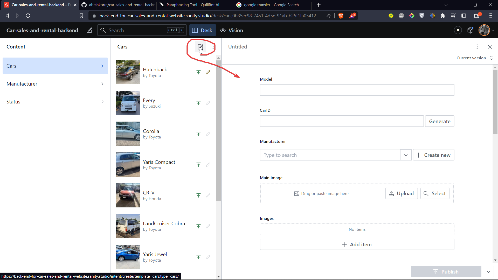
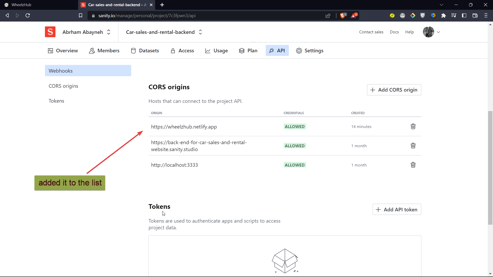

# Features
- [Add/Remove/Edit Car Details](#)

- [Edit Who can access the API](#Access-for-the-API)
  
- [Add Admins to add/remove/edit car details](#)

# Add Remove Edit Car Details
### It is easy doing such actions once you understand the dashboard. Lets see

##  `The Models`


<br>

## `Manufacturer Model`


<br>


## `Status Model`


<br>

## `The Car Model & How it is linked with the the above Models`


<br>


<br>

# `How can we add cars?`


<br>

# `How can we remove or Edit Car Details?`

<br>

# Access for the API

Sanity Studio provides an easy way to access APIs through its built-in HTTP client. This allows you to retrieve and update data from external APIs directly within the Sanity Studio interface.

To allow a website to access an API created using Sanity.io, you will need to enable CORS (Cross-Origin Resource Sharing) for your Sanity.io project.


## You can configure it in sanity.json file

To enable CORS for your Sanity.io project, you can add a cors configuration object to your sanity.json file. Here's an example:

```
{
  "api": {
    "projectId": "your-project-id",
    "dataset": "your-dataset-name",
    "cors": {
      "allowOrigins": ["https://example.com"],
      "allowCredentials": true,
      "allowHeaders": ["Authorization"],
      "maxAge": 86400
    }
  }
}
```

## Or easily from the dashboard

`Step 1: Head to the dashboard and under the the CORS orgins look out for the allowed hosts`<br>


<br>

`Step 2: Grab the link of the website that you want your api to be accessed`<br>


<br>
`Step 3: Add it to the list`<br>


<br>

`Step 4: Done. Now your website can use the API to fetch the data`<br>


<br>
